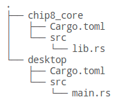
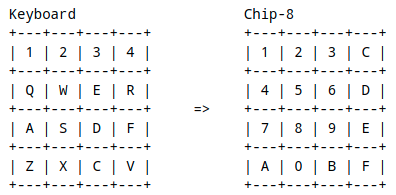

# Setup

Since the eventual goal of this project is to have an emulator which can be built for both the desktop and a web browser, we're going to structure this project slightly unusually. Between the two builds, the actual emulation of the Chip-8 system should be exactly the same, only things like reading in a file and displaying the screen will be different between desktop and browser. To that end, we will create the backend, which I will call the *core*, as its own crate to be used by both our future frontends.

Move into the folder where you will store your project and run the following command. Do not include the `$`, that is simply to indicate that this is a terminal instruction.

```
$ cargo init chip8_core --lib
```

The `--lib` flag tells `cargo` to create a library rather than an executable module. This is where our emulation backend will go. I called it `chip8_core` for the purposes of this project, but you are free to call it whatever you like.

As for the frontend, we'll create an additional crate to hold that code:

```
$ cargo init desktop
```

Unlike our core, this creates an actual executable project. If you've done it correctly, your folder structure should now look like this:



All that remains is to tell our `desktop` frontend where to find `chip8_core`. Open up `desktop/Cargo.toml` and under `[dependencies]` add the line:

```toml
chip8_core = { path = "../chip8_core" }
```

Since  `chip8_core` is currently empty, this doesn't actually add anything, but it's something that will need to be done eventually. Go ahead and try and compile and run the project, just to be sure everything is working. From inside the `desktop` directory, run:

```
$ cargo run
```

If everything has been setup correctly, "Hello, world!" should print out. Great! Next, we'll begin emulating the CPU and start creating something a little more interesting.

## Defining our Emulator

The most fundamental part of the system is the CPU, so we will begin there when creating our emulator. For the time being, we will mostly be developing the  `chip8_core` backend, then coming back to supply our frontend when it's well along. We will begin by working in the `chip8_core/src/lib.rs` file (you can delete the auto-generated `test` code). Before we add any functionality, let's refresh some of the concepts of what we're about to do.

Emulation is simply executing a program originally written for a different system, so it functions very similarly to the execution of a modern computer program. When running any old program, a line of code is read, understood by the computer to perform some task such as modifying a variable, making a comparison, or jumping to a different line of code; that action is then taken, and the execution moves to the next line to repeat this process. If you've studied compilers, you'll know that when a system is running code, it's not doing it line by line, but instead converts the code into instructions understood by the processor, and then performs this loop upon those. This is exactly how our emulator will function. We will traverse value by value in our game program, __fetching__ the instruction stored there, __decoding__ the operation that must be done, and then __executing__ it, before moving on to the next. This *fetch-decode-execute* loop will form the core of our CPU emulation.

With this in mind, let's begin by defining a class which will manage our emulator. In `lib.rs`, we'll add a new empty struct:

```rust
pub struct Emu {
}
```

This struct will be the main object for our emulation backend, and thus must handle running the actual game, and be able to pass need information back and forth from the frontend (such as what's on the screen and button presses).

## Program Counter

But what to put in our `Emu` object? As discussed previously, the program needs to know where in the game it's currently executing. All CPUs accomplish this by simply keeping an index of the current instruction, stored into a special *register* known as the *Program Counter*, or PC for short. This will be key for the *fetch* portion of our loop, and will increment through the game as it runs, and can even be modified manually by some instructions (for things such as jumping into a different section of code or calling a subroutine). Let's add this to our struct:

```rust
pub struct Emu {
    pc: u16,
}
```

## RAM

While we could read from our game file every time we need a new instruction, this is very slow, inefficient, and simply not how real systems do it. Instead, the Chip-8 is designed to copy the entire game program into its own RAM space, where it can then read and written to as needed. It should be noted that many systems, such as the Game Boy, do not allow the CPU to overwrite area of memory with the game stored in it (you wouldn't want a bug to completely corrupt game code). However, the Chip-8 has no such restriction. Since the Chip-8 was never a physical system, there isn't an official standard for how much memory it should have. However, it was originally designed to be implemented on computers with 4096 bytes (4 KB) of RAM, so that's how much we shall give it as well. Most programs won't come close to using it all, but it's there if they need it. Let's define that in our program.

```rust
const RAM_SIZE: usize = 4096;

pub struct Emu {
    pc: u16,
    ram: [u8; RAM_SIZE],
}

```

## The display

Chip-8 uses a 64x32 monochrome display (1 bit per pixel). There's nothing too special about this, however it is one of the few things in our backend that will need to be accessible to our various frontends, and to the user. Unlike many systems, Chip-8 does not automatically clear its screen to redraw every frame, instead the screen state is maintained, and new sprites are drawn onto it (there is a clear screen command however). We can keep this screen data in an array in our Emu object. Chip-8 is also more basic than most systems as we only have to deal with two colors - black and white. Since this is a 1-bit display, we can simply store an array of booleans like so:

```rust
pub const SCREEN_WIDTH: usize = 64;
pub const SCREEN_HEIGHT: usize = 32;

const RAM_SIZE: usize = 4096;

pub struct Emu {
    pc: u16,
    ram: [u8; RAM_SIZE],
    screen: [bool; SCREEN_WIDTH * SCREEN_HEIGHT],
}

```

You'll also notice that unlike our previous constant, we've defined the screen dimensions as public constants. This is one of the few pieces of information that the frontend will need to actually draw the screen.

## V Registers

While the system has quite a bit of RAM to work with, RAM access is usually considered fairly slow (but still orders of magnitude faster than reading from disc). To speed things up, the Chip-8 defines sixteen 8-bit *registers* which the game can use as it pleases for much faster operation. These are referred to as the *V registers*, and are usually numbered in hex from V0 to VF (I'm honestly not sure what the *V* stands for), and we'll group them together in one array in our Emu struct.

```rust
pub const SCREEN_WIDTH: usize = 64;
pub const SCREEN_HEIGHT: usize = 32;

const RAM_SIZE: usize = 4096;
const NUM_REGS: usize = 16;

pub struct Emu {
    pc: u16,
    ram: [u8; RAM_SIZE],
    screen: [bool; SCREEN_WIDTH * SCREEN_HEIGHT],
    v_reg: [u8; NUM_REGS],
}

```

## I Register

There is also another 16-bit register known as the *I register*, which is used for indexing into RAM for reads and writes. We'll get into the finer details of how this works later on, for now we simply need to have it.

```rust
pub const SCREEN_WIDTH: usize = 64;
pub const SCREEN_HEIGHT: usize = 32;

const RAM_SIZE: usize = 4096;
const NUM_REGS: usize = 16;

pub struct Emu {
    pc: u16,
    ram: [u8; RAM_SIZE],
    screen: [bool; SCREEN_WIDTH * SCREEN_HEIGHT],
    v_reg: [u8; NUM_REGS],
    i_reg: u16,
}

```

## The stack
## 栈
The CPU also has a small *stack*, which is an array of 16-bit values that the CPU can read and write to. The stack differs from regular RAM as the stack can only be read/written to via a "Last In, First Out (LIFO)" principle (like a stack of pancakes!), when you go to grab (pop) a value, you remove the last one you added (pushed). Unlike many systems, the stack is not general purpose. The only times the stack is allowed to be used is when you are entering or exiting a subroutine, where the stack is used to know where you started so you can return after the routine ends. Again, Chip-8 doesn't officially state how many numbers the stack can hold, but 16 is a typical number for emulation developers. There are a number of different ways we could implement our stack, perhaps the easiest way would be to use the `std::collections::VecDeque` object from Rust's standard library. This works fine for a Desktop-only build, however at the time of writing, many items in the `std` library don't work for WebAssembly builds. Instead we will do it the old fashioned way, with a statically sized array and an index so we know where the top of the stack is, known as the *Stack Pointer* (SP).

cpu也有一个小的*栈*，它是一个16位cpu可以读和写的数组。这个栈不同于一般RAM,像栈仅能按一个"后进显出(LIFO)"的原则进行读/写,当你获取一个值，你移除一个你之前添加的.不像一些系统，栈不是一般目的，仅仅当你进入或者退出一个子实例时候而被使用的仅有的次数，当栈被用于你从哪儿开始，所以你能在子实例结束后返回。再如，chip-8不提供栈拥有多少个的状态，但是，16对于模拟器开发者是一个典型的数字。这里有许多不同方式来实现我们的栈，可能最容易的方式是使用rust标准对象库`std::collectoins::VecDeque`。这个对于仅是桌面应用构建能很好工作。但是在编写时，在`std`库的一些项目不能赋予webAssembly的构建工作上。如此，我们将用一个古老的流行的方式，使用一个静态大小的数组和一个索引，所以，我们能够知道栈的顶部在哪，正如*Stack Pointer*(SP).

```rust
pub const SCREEN_WIDTH: usize = 64;
pub const SCREEN_HEIGHT: usize = 32;

const RAM_SIZE: usize = 4096;
const NUM_REGS: usize = 16;
const STACK_SIZE: usize = 16;

pub struct Emu {
    pc: u16,
    ram: [u8; RAM_SIZE],
    screen: [bool; SCREEN_WIDTH * SCREEN_HEIGHT],
    v_reg: [u8; NUM_REGS],
    i_reg: u16,
    sp: u16,
    stack: [u16; STACK_SIZE],
}

```

## The keys
## 键盘

Chip-8 supports a surprisingly large 16 different keys, typically numbered in hexadecimal from 0 through 9, A through F. The keys are arranged similarly to a telephone layout, with A and B placed to either side of 0, and C thru F placed on the right column, making a 4x4 grid.

Chip-8支持比较多的16个不同的键值，典型的数字是十六进制的0到9，A到F。键的布局类似于一个电话的布局，用A和B放在0的两边，C到F安排的右边列，制成4x4的网格。



We need to keep track of which of the keys are pressed, thus we can use an array of booleans to track the states.

我们需要保持哪个键被按下的跟踪，因此，我们能够使用布尔数组来跟踪这个状态

```rust
pub const SCREEN_WIDTH: usize = 64;
pub const SCREEN_HEIGHT: usize = 32;

const RAM_SIZE: usize = 4096;
const NUM_REGS: usize = 16;
const STACK_SIZE: usize = 16;
const NUM_KEYS: usize = 16;

pub struct Emu {
    pc: u16,
    ram: [u8; RAM_SIZE],
    screen: [bool; SCREEN_WIDTH * SCREEN_HEIGHT],
    v_reg: [u8; NUM_REGS],
    i_reg: u16,
    sp: u16,
    stack: [u16; STACK_SIZE],
    keys: [bool; NUM_KEYS],
}

```


## The timers
## 时钟
This has been a lot to process at once, but we're now at the final items. Chip-8 also has two other special registers that it uses as *timers*. The first, the *Delay Timer* is used by the system as a typical timer, counting down every cycle and performing some action if it hits 0. The *Sound Timer* on the other hand, also counts down every clock cycle, but upon hitting 0 emits a noise. Setting the *Sound Timer* to 0 is the only way to emit audio on the Chip-8, as we will see later. These are both 8-bit registers, and must be supported for us to continue.

一次有很多事情需要去处理，但是，我们现在处于最后单元。Chip-8也有两个其他的专有寄存器，它被*时钟*所使用。首先，*延时时钟*被系统用于一个典型时钟，每个周期向下计数，如果达到0，执行一些动作。另一个是*声音时钟*，也是每个时钟周期向下计数，但是达到0时触发一个噪音。设置*声音时钟*为0，仅仅触发chip-8上的声音调用，如我们后面所了解的。这里有两个8位寄存器，必须支持我们的计数。


```rust
pub const SCREEN_WIDTH: usize = 64;
pub const SCREEN_HEIGHT: usize = 32;

const RAM_SIZE: usize = 4096;
const NUM_REGS: usize = 16;
const STACK_SIZE: usize = 16;
const NUM_KEYS: usize = 16;

pub struct Emu {
    pc: u16,
    ram: [u8; RAM_SIZE],
    screen: [bool; SCREEN_WIDTH * SCREEN_HEIGHT],
    v_reg: [u8; NUM_REGS],
    i_reg: u16,
    sp: u16,
    stack: [u16; STACK_SIZE],
    keys: [bool; NUM_KEYS],
    dt: u8,
    st: u8,
}
```

## Initialization
## 初始化

That should do it for now, let's go ahead and implement a `new` constructor for this class before we move onto the next part. Following the `struct` definition, we'll implement and set the default values:

这个现在需要做的，让我们向前，在我们转移到下一章之前，实现一个`新`构建作为新类。跟随`struct`定义，我们将实现和设置默认值：

```rust
// -- Unchanged code omitted --

const START_ADDR: u16 = 0x200;

// -- Unchanged code omitted --

impl Emu {
    pub fn new() -> Self {
        Self {
            pc: START_ADDR,
            ram: [0; RAM_SIZE],
            screen: [false; SCREEN_WIDTH * SCREEN_HEIGHT],
            v_reg: [0; NUM_REGS],
            i_reg: 0,
            sp: 0,
            stack: [0; STACK_SIZE],
            keys: [false; NUM_KEYS],
            dt: 0,
            st: 0,
        }
    }
}
```

Everything seems pretty straightforward, we simply initialize all values and arrays to zero... except for our Program Counter, which gets set to 0x200 (512 in decimal). I mentioned the reasoning behind this in the previous chapter, but the emulator has to know where the beginning of the program is, and it is Chip-8 standard that the beginning of all Chip-8 programs will be loaded in starting at RAM address 0x200. This number will come up again, so we've defined it as a constant.

每件事看起来相当完美，我们简单初始化所有的值和数组为0...,除了我们的程序计数器，设置它的值为0x200(十进制的数字512).在此之前的一章，我曾提及这个原因，但是这个模拟器必须知道程序从哪开始运行，它是所有chip-8标准的开始，将会加载chip-8程序到内存地址的0x200的地方。这个数字将会再现，所以我们定义它为常数。

That wraps up this part! With the basis of our emulator underway, we can begin to implement the execution!

这部分内容就此结束!在我们这个模拟器基础工作的开启，我们将开始实现这个执行。
\newpage
