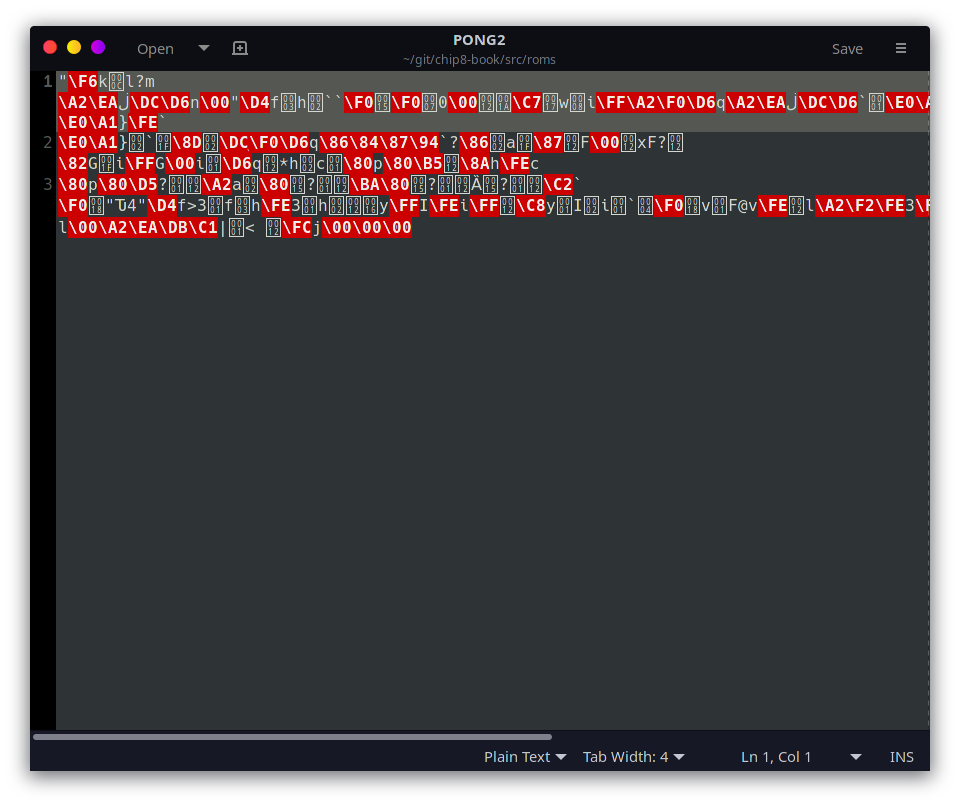
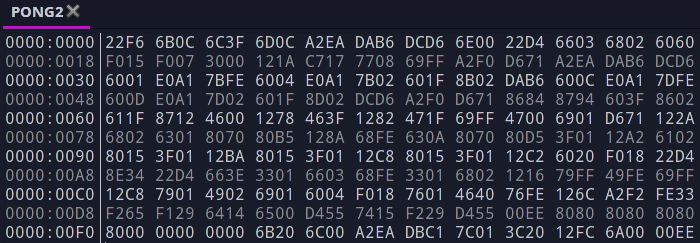

# Emulation Basics {#eb}
# 模拟器基础{#eb}
This first chapter is an overview of the concepts of emulation development and the Chip-8. Subsequent chapters will have code implementations in Rust, if you have no interest in Rust or prefer to work without examples, this chapter will give an introduction to what steps a real system performs, what we need to emulate ourselves, and how all the moving pieces fit together. If you're completely new to this subject, this should provide the information you'll need to wrap your head around what you're about to implement.

第一章是模拟器开发和chip8概念的概览.接下来章节将用Rust代码实现，如果你没有兴趣于rust或者宁可不用例子来工作，这章将给出一个真实系统平台的步骤是什么，什么是我们需要模拟的，和怎样把所有这些碎块湊一起。如果对于这个主题你是新手，这将提供打包关于你要是实现什么的信息给你。

## What's in a Chip-8 Game?
## 一个chip-8游戏是什么？
Let's begin with a simple question. If I give you a Chip-8 ROM[^1] file, what exactly is in it? It needs to contain all of the game logic and graphical assets needed to make a game run on a screen, but how is it all laid out?

让我们用一个简单问题开始。如果我给你一个chip-8 rom文件,在这个rom里面确定是什么？它需要包含所有游戏逻辑和图形资源，这些图形资源被用于制作一个游戏运行在屏幕上面，但是它是怎样布局的呢？

This is a basic, fundamental question; our goal is to read this file and make its program run. Well, there's only one way to find out, so let's try and open a Chip-8 game in a text editor (such as Notepad, TextEdit, or any others you prefer). For this example, I'm using the `roms/PONG2` game included with this guide. Unless you're using a very fancy editor, you should probably see something similar to Figure 1.

这是一个基本的，基础性的问题:我们的目标是去读这个文件，然它的程序跑起来。仅有一个方式来找出，所以，让我们尝试和用一个文本编辑器打开一个Chip-8游戏(比如 Notepad,TextEdit,或者其他你喜欢的)。对于这个例子，我们将使用在导论里面包含的'rom/PONG2'游戏。除非你使用一个非常喜欢的编辑器，你将看到类似图1里面的一些东西。

This doesn't seem very helpful. In fact, it seems corrupted. Don't worry, your game is (probably) just fine. All computer programs are, at their core, just numbers saved into a file. These numbers can mean just about anything; it's only with context that a computer is able to put meaning to the values. Your text editor was designed to show and edit text in a language such as English, and thus will automatically try and use a language-focused context such as [ASCII](https://www.asciitable.com/).

这些看起来不是很有帮助。事实上，它看起来被损坏了。别担心，你的游戏(可能)很好。在他们的内核，所有计算机程序仅是数字化保存在一个文件里。这些数字的意思仅是关于一些事情；它仅仅一个计算机能把意思转达到值的上下文。你的文本编辑器仅被设计成显示和用一个类似英语的语言编辑文本，因此，将自动尝试和使用一个语言方面的上下文，正如ascii码.

So we've learned that our Chip-8 file is not written in plain English, which we probably could have assumed already. So what does it look like? Fortunately, programs exist to display the raw contents of a file, so we will need to use one of those "hex editors" to display the actual contents of our file.

所以，我们学习的chip8文件不是用朴素的英语编写的，这是我们可能的假设。所以，它看起来像什么?幸运的是，存在程序来显示一个文件的原始上下文，所以，我们将需要使用这些"十六进制"编辑器来显示我们文件的实际内容。

In Figure 2, the numbers on the left of the vertical line are the *offset* values, how many bytes we are away from the start of the file. On the right hand side are the actual values stored in the file. Both the offsets and data values are displayed in hexadecimal (we'll be dealing with hexadecimal quite a bit).

在图2,在垂直线的左边上的数字是”偏移“值,我们距离文件开始多远的字节数。在右手边是实际存在文件里的值。包括偏移和数据值，这些以十六进制显示(我们将需要使用十六进制来处理)

Okay, we have numbers now, so that's an improvement. If those numbers don't correspond to English letters, what do they mean? These are the *instructions* for the Chip-8's CPU. Actually, each instruction is two bytes, which is why I've grouped them in pairs in the screenshot.

ok,我们现在有数字了，所以这有所改善。如果这些数字不能于英语字母对应，他们的意思是什么呢？这些是对于Chip-8 CPU的"指令".实际上，每个指令是两个字节，其是为什么我们成对分组他们在截屏里的。
## What is a CPU?
## 一个cpu是什么?
Let me take a moment to describe exactly what functionality a CPU provides, for those who aren't familiar. A CPU, for our purposes, does math. That's it. Now, when I say it "does math", this includes your usual items such as addition, subtraction, and checking if two numbers are equal or not. There are also additional operations that are needed for the game to run, such as jumping to different sections of code, or fetching and saving numbers. The game file is entirely made up of mathematical operations for the CPU to preform.

让我们花一点时间，为哪些不熟悉的人，来精确地描述一个cpu提供了什么功能，一个cpu，4个目标，完成算术。现在，当我们说它是"做算术",它包含你通常的项目，比如加，减，和检查两个数是相等或者不相等。也有对于游戏运行的需要的添加操作，比如跳转到不同代码区域，或者遍历和保存数字。整个游戏文件由让cpu执行的算术操作来组成。

All of the mathematical operations that the Chip-8 can perform have a corresponding number, called its *opcode*. A full list of the Chip-8's opcodes can be seen on [this page](#ot). Whenever it is time for the emulator to perform another instruction (also referred to as a *tick* or a *cycle*), it will grab the next opcode from the game ROM and do whatever operation is specified by the opcode table; add, subtract, update what's drawn on the screen, whatever.

所有的chip-8的算术操作能执行对应的数字，叫它"操作码".一个完整chip-8的操作码列表能在本页看见。每当模拟器执行其他指令的时候(也引用为一个"tick“或者"cycle"),它将从游戏rom遍历下一个opcode，通过操作码表来做专门做什么的操作；加法，减法，更新什么绘制在屏幕上，诸如此类。

What about parameters? It's not enough to say "it's time to add", you need two numbers to actually add together, plus a place to put the sum when you're done. Other systems do this differently, but two bytes per operation is a lot of possible numbers, way more than the 35 operations that Chip-8 can actually do. The extra digits are used to pack in extra information into the opcode. The exact layout of this information varies between opcodes. The opcode table uses `N`'s to indicate literal hexadecmial numbers. `N` for single digit, `NN` for two digits, and `NNN` for three digit literal values, or for a *register* to be specified via `X` or `Y`.

什么是参数?这个不足够说"去加上",你需要两个数字实际地一起加，加一个空间来存放你完成的和。其他系统不同来做这些，但是，每个操作的两个字节是许多可能的数字，将超过35个实际操作在chip-8能被实际的完成。这额外的数字被用于打包额外信息到操作码。这个操作表使用'N'来表示字面上的十六进制数，‘N'作为单一数字，’NN‘为两个数字，’NNN‘是3个数字连起来的值，或者对于一个“寄存器"是专门’X‘或者'Y'.

## What are Registers?
## 什么是寄存器？

Which brings us to our next topic. What on earth is a register? A *register* is a specially designated place to store a single byte for use in instructions. This may sound rather similar to RAM, and in some ways it is. While RAM is a large addressable place to store data, registers are usually few in number, they are all named, and they are directly used when executing an opcode. For many computers, if you want to use a value in RAM, it has to be copied into a register first.

我们接下来主题是哪个？在地球上什么是一个寄存器?一个寄存器是一个专门设计的地方来存储给指令里面使用的一个单一字节。这个听起来想当类似于RAM,在一些方式下面是这样的。当RAM是许多可寻址的空间来存储数据，寄存器通常很少在数字里，所有他们是被命名的，当执行一个操作码时他们直接被使用。对于一些计算机，如果你想要在RAM里面使用一个值，它必须首先被拷贝到一个寄存器里。

The Chip-8 has sixteen registers that can be used freely by the programmer, named V0 through VF (0-15 in hexadecimal). As an example of how registers can work, let's look at one of the addition operations in our opcode table. There is an operation for adding the values of two registers together, VX += VY, encoded as `8XY4`. The `8XY4` is used for pattern matching the opcodes. If the current opcode begins with an 8 and ends with a 4, then this is the matching operation. The middle two digits then specify which registers we are to use. Let's say our opcode is `8124`. It begins with an 8 and ends with a 4, so we're in the right place. For this instruction we will be using the values stored in V1 and V2, as those match the other two digits. Let's say V1 stores 5 and V2 stores 10, this operation would add those two values and replace what was in V1, thus V1 now holds 15.

Chip-8有十六个寄存器，能够被程序员自由地使用，命名V0到VF(0-15的十六进制)，
作为一个寄存器怎样工作的一个例子，让我们查看我们操作码表里面一个加法操作。对于两个寄存器的相加一个操作，VX += VY，编码为'8XY4'.这个'8XY4'被用于模式匹配操作码。如果当前操作码开始一个8和以一个4结尾，然后这个时匹配操作。这中间两个数字，专指我们使用的寄存器。让我们拿操作时'8124'来说，它开始于一个8和结束于一个4,所以，我们在正确的地方。对于这个指令，我们将使用这个值存储在寄存器V1和V2里，正如这些匹配其他两个数字。让我们说V1存储5和V2存储10,这个操作将加这些两个值，替换V1里面的内容，因此V1现在拥有15.

Chip-8 contains a few more registers, but they serve very specific purposes. One of the most significant ones is the *program counter* (PC), which for Chip-8 can store a 16-bit value. I've made vague references to our "current opcode", but how do we keep track of where we are? Our emulator is simulating a computer running a program. It needs to start at the beginning of our game and move from opcode to opcode, executing the instructions as it's told. The PC holds the index of what game instruction we're currently working on. So it'll start at the first byte of the game, then move on to the third (remember all opcodes are two bytes), and so on and so forth. Some instructions can also tell the PC to go somewhere else in the game, but by default it will simply move forward opcode by opcode.

Chip-8包含一些更多的寄存器，但是他们用于专门目的。最重要之一是"程序计数器",对于Chip-8其能存储一个16位值。我已经做了模糊的引用我们“当前操作码",但是，我们怎样保持我们处于哪里的跟踪？我们模拟器是一个模拟一个计算机运行一个程序。它需要开始我们游戏的初始处，从操作移动到操作码，执行他们被告知的指令。这个PC拥有我们当前执行游戏指令的索引。所以它将开始于游戏的第一个字节，然后移动到第三(记得所有的操作码是两个字节)，如此等等。一些指令也能告诉PC去游戏里面的一些其他地方，但是默认它将简单向前一个接一个。

## What is RAM?
## 什么是RAM?

We have our sixteen V registers, but even for a simple system like a Chip-8, we really would like to be able to store more than 16 numbers at a time. This is where *random access memory* (RAM) comes in. You're probably familiar with it in the context of your own computer, but RAM is a large array of numbers for the CPU to do with as it pleases. Chip-8 is not a physical system, so there is no standard amount of RAM it is supposed to have. However, emulation developers have more or less settled on 4096 bytes (4 KB), so our system will have the ability to store up to 4096 8-bit numbers in its RAM, way more than most games will use.

我们有16个V寄存器，但是即使像chip-8这样的一个简单系统，我们将想要能够存储一次多于16个数字。这是*随即访问内存*(RAM)的出处.你可能熟悉你自己计算机上下文里面的，但是RAM对于cpu是许多它乐意去做的。Chip-8不是一个物理系统，所以，没有标准的RAM所支持的大小。但是，模拟器开发者有或多或少安排在4096字节(4KB)，所以，我们系统将能够存储4096个8位数据它们的RAM里，远远足够大多数游戏的使用。

Now, time for an important detail: The Chip-8 CPU has free access to read and write to RAM as it pleases. It does not, however, have direct access to our game's ROM. With a name like "Read-Only Memory", it's safe to assume that we weren't going to be able to overwrite it, but the CPU can't read from ROM either? While the CPU needs to be able to read the game ROM, it accomplishes this indirectly, by copying the entire game into RAM[^2] when the game starts up. It is rather slow and inefficient to open our game file just to read a little bit of data over and over again. Instead, we want to be able to copy as much data as we can into RAM for us to more quickly use. The other catch is that somewhat confusingly, the ROM data is not loaded into very start of RAM. Instead, it's offset by 512 bytes (0x200). This means the first byte of the game is loaded at start into RAM address 0x200. The second ROM byte into 0x201, etc.

现在，对于一个重要细节的时候:chip-8 cpu可以自由地如它所愿的去读或者写到RAM。但是，它不直接访问我们的游戏ROM。使用一个名称像"只读内存",它是安全的假设我们将不能够覆写，但是cpu也不能从ROM读？当cpu需要能够读游戏的ROM,当游戏开始时，它通过拷贝整个游戏到RAM[^2]来直接的实现。这样是相当慢，不影响打开我们游戏文件，仅仅去读一遍又一遍的一些数据。相应的，我们想要能够拷贝更多数据，正如我们能够从RAM里面提供给我们更快的使用。其他捕获的混淆的一些内容，ROM数据不被加载到RAM开始处。为此，它是一个512字节的偏移(0x200).这以为这游戏的第一个字节是被加载内存的地址0x200处。第二个ROM字节是在0x201,等等。

Why doesn't the Chip-8 simply store the game at the start of RAM and call it a day? Back when the Chip-8 was designed, computers had much more limited amount of RAM, and only one program could run at a given time. The first 0x200 bytes were allocated for the Chip-8 program itself to run in. Thus, modern Chip-8 emulators need to keep that in mind, as games are still developed with that concept. Our system will actually use a little bit of that empty space, but we will cover that later.

为什么不简单存储Chip-8的游戏在内存开始处,然后访问？回到Chip-8的当初设计，计算机有更多RAM大小的限制，仅有一个程序在给定的时间可以运行。起始的0x200字节被分配给Chip-8程序自身在里面运行。因此，现代Chip-8模拟器需要保持这些在脑中，正如游戏仍然使用这个概念开发。我们系统实际使用一点空的空间，但是我们将在后面覆盖。

[^1]: 'ROM' stands for "Read-only memory". It is a type of memory that is hard written at manufacturing time and cannot be modified by the computer system. For the purposes of this guide "ROM file" will be used interchangeably with "game file".

'ROM'基于'只读内存'.它是内存的一种类型，在生产时期被硬写，不能被计算机系统所修改，对于这个导引的"ROM文件"将被交互地用于"游戏文件"

[^2]: Therefore, Chip-8 games have a maximum size of 4 KB, any larger and they can't be completely loaded in.

因此,Chip-8游戏的最大存储大小是4KB，一些将更大，他们不能完全被加载.

\newpage
